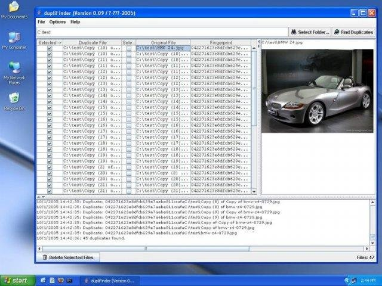

# dupliFinder
Version 0.09 (27 February 2005)

dupliFinder is an app that searches your computer for duplicate files by comparing the MD5 sum of each file.

You then have the option of deleting any duplicate files found.

